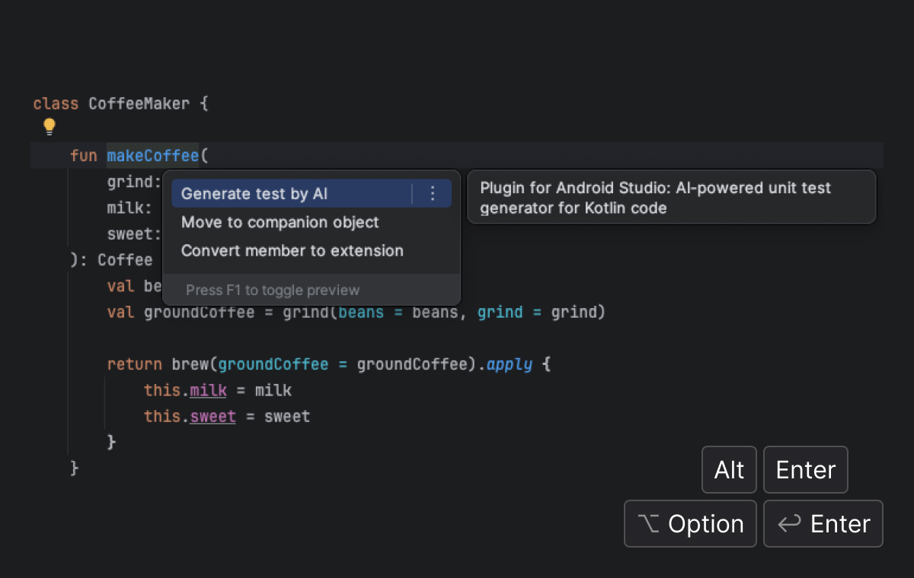
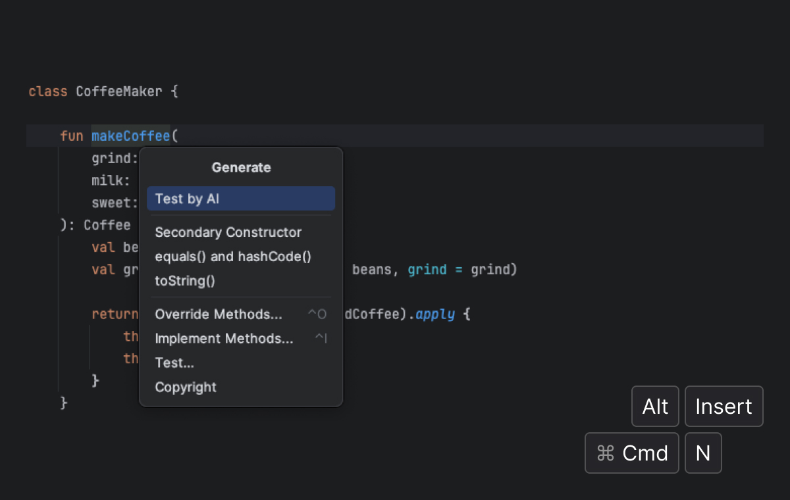

# KaiTester Intellij Plugin

<!-- Plugin description start -->
Plugin for the JetBrains editor family (IntelliJ IDEA, Android Studio, etc.) 
AI-powered unit test generator for Kotlin code.
<!-- Plugin description end -->

## Features

✅ Generate unit tests by AI 
🔜 Generate unit tests using example 
🔜 Generate names for unit tests by templates

## Installation

Installation available from JetBrains Marketplace:
1. From IDE: `Settings...` ➡️ `Plugins` ➡️ Search: `KaiTester` ➡️ `Install`
2. Restart IDE

## Using

1. Place your cursor on the function you want to test  
2. For Windows: `Alt` + `Enter` or `Alt` + `Insert` 
   For Mac: `Option` + `Enter` or `Cmd` + `N`
3. `Generate test by AI`

## Screenshots

## Contacts

For any questions or feedback, feel free to contact:

- Telegram: [@maxastin](https://t.me/maxastin)
- LinkedIn: [@maxastin](https://www.linkedin.com/in/maxastin/)